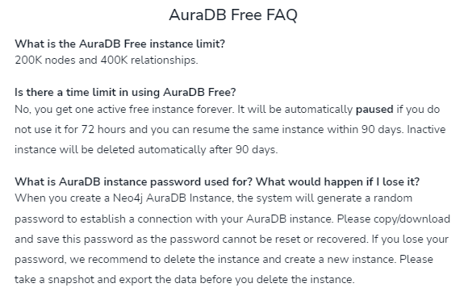
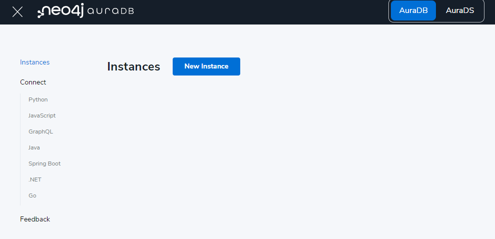
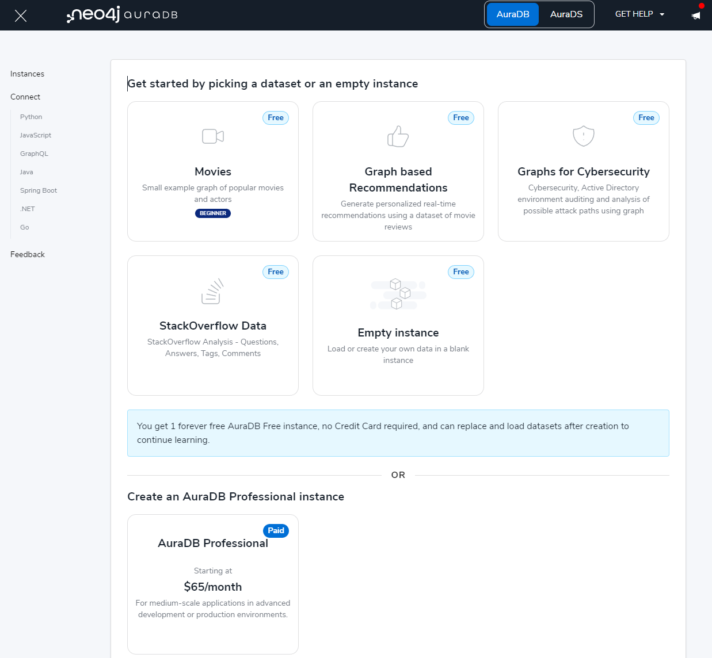
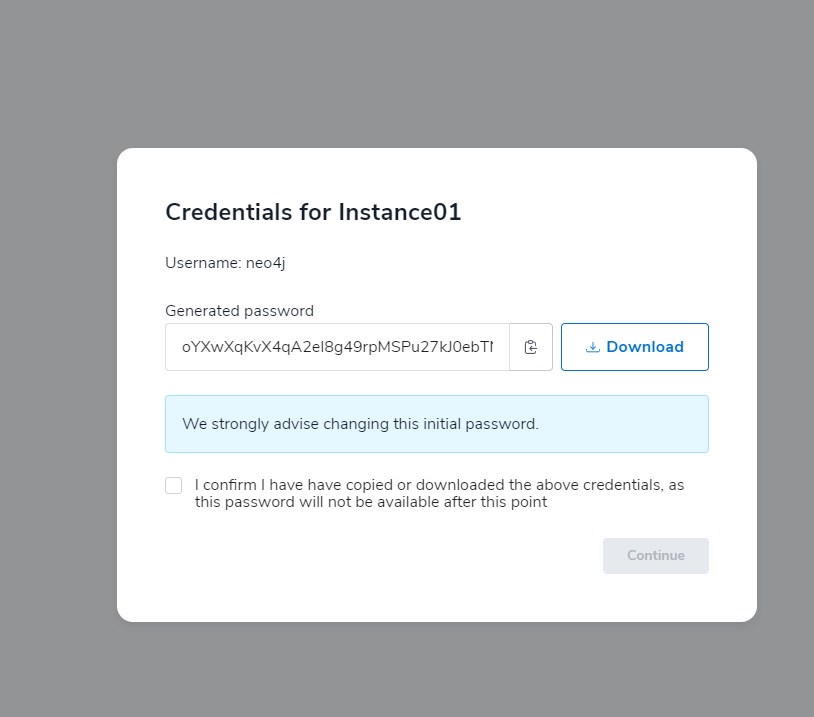
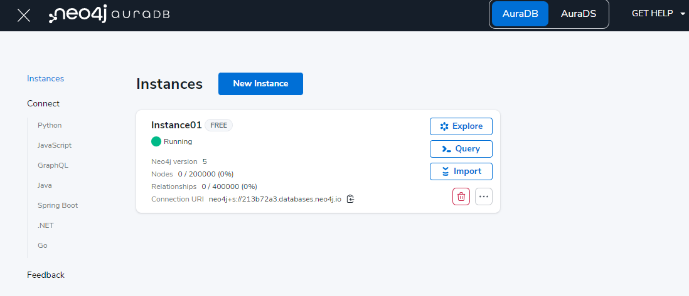
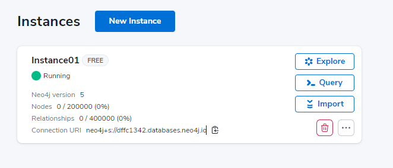
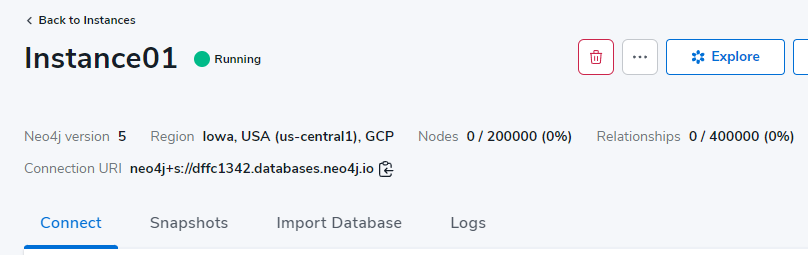

# COSC 516 - Cloud Databases Lab 6 - AuraDB Neo4J

## Setup
Create a free tier account at: [https://neo4j.com/cloud/platform/aura-graph-database/].

## Neo4j AuraDB Portal
Create an AuraDB free account. 

## Create an AuraDB Free Account

In the AuraDB dashboard, Instance > `New instance`. 

 

Choose `Empty Instance` for the assignment. (You may also choose one of the sample datasets to play around). 

 

Select `Empty Instance` and click on `Create`. Do not forget to store the password, as once the password is lost, you will have to delete the instance and start from scratch (Unless you have taken a snapshot).

 

The instance will take some time to spin up. 

 

Once ready, we load data into the database by making use of a pre-recorded snapshot of a Neo4J database. The snapshot needs to be imported. There are various other ways to import different types of data to the database (Not needed for this assignment). Please check documentation for the same. 

Select (Click on) the instance that you just created. 

 
 
 You may find sample code here. 
 
 Click on the `import Database` tab 
 
 
 

Then select/upload the neo4j.dump file located under DBdump directory. Click on upload. The instance will take some time to load the data. 

After the data is loaded, you are now ready to work on the assignment. The assignment is in python. 

## Python Package Installation
You will have to install the neo4j package by running:

`pip install neo4j`

The above command can be run on your visual code terminal or your system terminal, provided you have python (as well as pip) installed.

## References to Guides: 
https://neo4j.com/docs/getting-started/current/ 

https://neo4j.com/developer/graph-database/ 

## Tasks
Write Python code using VS Code. The file to edit is `AssignmentNeo4j.py`.  The test file is `testNeo4j.py`. Fill in the methods requested (search for **TODO**).  Marks for each method are below.  You receive the marks if you pass the unit tests AND have followed the requirements asked in the question (including documentation and proper formatting).

A sample code is provided in `neo4jSample.py`.

- +1 mark - Write the method connect() to make a connection to the database. Sample code is available in [Neo4J Python](https://neo4j.com/developer/python/) 
- +1 mark - Write the method close() to close the connection to the database.  
- +3 marks - Load the following data: 
  - Add an entity labeled as 'actor' as well as an 'alien' with properties {'bio':'Extraterrestrial', born:'1200-01-01', bornIn:"Mars", name:"ET"} to the movie titled 'E.T. the Extra-Terrestrial' and 'Jumanji' 
  - Add a review by Person with ID 34047 for the movie  'Jumanji' with a rating of 90 and summary as "It was fun to watch in 3D" 
  
  Note: Test cases for load is not defined but verified by tests for other queries. 
- +2 marks - Write query1() to display names of all movies and the year it released. Sorted by year. 
- +2 marks - Write query2() to display the names of the actors who have also directed at least one movie. Ordered by Actor name (ascending order). No Duplicates. 
- +2 marks - Write query3() to count the number of actors present in the database, who were born in Canada. 
- +3 marks - Write query4() to compute the average rating given (excludes reviews) by an user for all movies, sorted by descending order. Average rating rounded to 2 decimal places. 
- +3 marks - Write query5() to return person (name only) and movie name where the person has reviewed (excludes ratings) the movie, where rating (associated with review) > 50 and review has at least one mention of the word "fun". Sorted by person name in ascending order, followed by movie name in descending order.
- +3 marks - Count the number of second order connections for user `Paul Blythe`.

**Total Marks: 20**

## Bonus Marks: (up to 2)
Up to +2 bonus marks for demonstrating some other feature of Neo4j/AuraDB.

## Submission
The lab can be marked immediately by the professor or TA by showing the output of the unit tests and by a quick code review.  Otherwise, submit the URL of your GitHub repository on Canvas. **Make sure to commit and push your updates to GitHub.**
